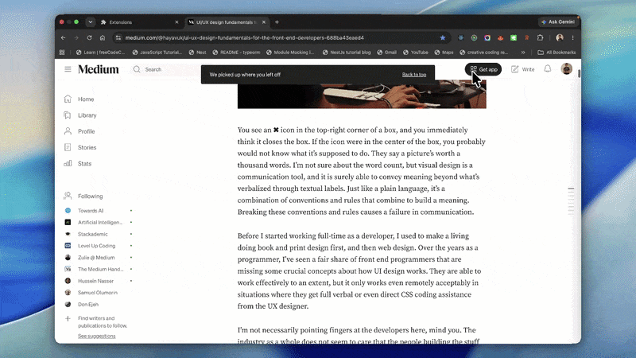

# Repin AI

Repin is an AI workspace that understands what users encounter on the web,
remembers what matters, and can eventually act on their behalf.



The browser extension works in the context of the current page. The web
application is the durable workspace for conversations, saved knowledge,
activity, memories, and agent execution history.

## Product direction

Repin is built around three connected capabilities:

1. **Understand** the active page, selected text, conversation, and user intent.
2. **Remember** useful pages, notes, highlights, conversations, and trusted
   context.
3. **Act** through typed browser tools with observable execution, permission
   boundaries, and human approval for consequential actions.

The current system provides this foundation. Fully autonomous operation remains
an incremental product goal.

Repin is under active development. Browser actions are observable and subject
to explicit permission and approval boundaries; autonomy is expanded
incrementally as those safeguards mature.

## Current capabilities

- Explain, summarize, translate, and chat about pages or selected text
- Save pages, bookmarks, notes, highlights, and scoped memories
- Continue persistent conversations across the web app and extension
- Execute browser tools through the extension or a managed Playwright session
- Run resumable agent tasks and workflows with approvals and verification
- Persist data in PostgreSQL and process background work with Redis and BullMQ
- Export vendor-neutral traces and metrics through OpenTelemetry

## Project structure

| Path                     | Purpose                                                                                        |
| ------------------------ | ---------------------------------------------------------------------------------------------- |
| `apps/server`            | NestJS API, AI orchestration, agent runtime, browser tools, workflows, queues, and persistence |
| `apps/web`               | Next.js workspace for conversations, activity, saved content, and settings                     |
| `apps/extension`         | WXT browser extension for contextual assistance and browser actions                            |
| `apps/docs`              | Product and developer documentation application                                                |
| `packages/contracts`     | Shared wire contracts and schemas                                                              |
| `packages/client`        | Shared API and client-state utilities                                                          |
| `packages/ui`            | Shared React components                                                                        |
| `packages/observability` | Shared telemetry contracts                                                                     |

## Install with Docker Compose

### Requirements

- Docker with Docker Compose
- An API key for the configured AI provider

### 1. Configure Repin

```bash
cp .env.example .env
```

Open `.env` and set at least:

```env
AI_API_KEY=your-provider-api-key
```

The defaults use an OpenAI-compatible API. Change `AI_PROVIDER`, `AI_BASE_URL`,
and `AI_MODEL` in `.env` when using another compatible provider. Replace the
development authentication secrets before deploying Repin.

### 2. Start Repin

```bash
docker compose up --build -d
```

Docker Compose starts the web application, API, PostgreSQL, and Redis. Database
migrations run automatically when the server starts.

Open:

- Web application: `http://localhost:3000`
- API: `http://localhost:3001/api`
- Swagger UI: `http://localhost:3001/docs`

Useful lifecycle commands:

```bash
docker compose logs -f
docker compose down
```

Use `docker compose down -v` only when you intentionally want to delete the
local PostgreSQL and Redis data volumes.

## Install the browser extension

### Option A: Build the Chrome extension with Docker

This is the simplest option and does not require installing Node.js locally.

1. Export the Chromium extension bundle:

   ```bash
   docker compose --profile extension run --rm extension
   ```

2. Open `chrome://extensions` in Chrome, or `edge://extensions` in Edge.
3. Enable **Developer mode**.
4. Select **Load unpacked**.
5. Choose the generated `extension-dist` directory in this repository.
6. Pin Repin from the browser toolbar.
7. Open the Repin popup and authorize the extension through the web app.

The development extension connects to:

- API: `http://localhost:3001`
- Web application: `http://localhost:3000`

If the extension bundle changes, run the export command again and select
**Reload** on the Repin card in the browser's extensions page.

### Option B: Run the extension in development mode

Use this option when actively changing extension code.

Requirements:

- Node.js `>=22.18.0`
- Corepack and pnpm 9

Install dependencies and start WXT:

```bash
corepack enable
pnpm install
pnpm --filter extension dev
```

WXT builds the extension in development mode and opens a browser profile with
the extension loaded. Keep the command running for automatic rebuilds.

To create a regular unpacked Chromium build instead:

```bash
pnpm --filter extension build
```

Load the generated Chromium directory under `apps/extension/.output` using the
same **Load unpacked** steps above.

### Firefox

Start Firefox development mode with:

```bash
pnpm --filter extension dev:firefox
```

To build it manually:

```bash
pnpm --filter extension build:firefox
```

Then:

1. Open `about:debugging#/runtime/this-firefox`.
2. Select **Load Temporary Add-on**.
3. Open the generated Firefox directory under `apps/extension/.output`.
4. Select its `manifest.json` file.

Firefox removes temporary add-ons when the browser closes. Distribution
outside development requires packaging and signing through Mozilla.

### Production extension IDs

During local development, an empty `EXTENSION_CLIENT_IDS` value permits
unpacked extension IDs. In production, set it to the comma-separated Chrome Web
Store extension IDs that are allowed to authenticate.

## Local monorepo development

Use Docker Compose for PostgreSQL and Redis, then run the applications through
the pnpm workspace:

```bash
corepack enable
pnpm install
docker compose up -d postgres redis
pnpm dev
```

Copy the relevant environment examples before starting an application outside
Docker. The root [`.env.example`](./.env.example) documents the shared defaults;
application-specific examples live beside the server and web app.

## Development checks

When changing the codebase, run:

```bash
pnpm build
pnpm lint
pnpm check-types
pnpm --filter server test
```

Environment options are documented in [`.env.example`](./.env.example) and
[`apps/server/.env.example`](./apps/server/.env.example).

## License

Repin is available under the terms in [`LICENSE`](./LICENSE).
